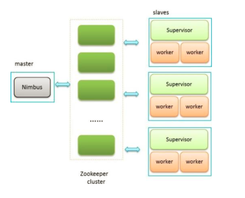

### Storm的架构
- [x] Storm集群由一个主节点和多个工作节点组成。
- [x] 主节点运行了一个名为“Nimbus”的守护进程，用于分配代码、布置任务及故障检测。
- [x] 每个工作节点都运行了一个名为“Supervisor”的守护进程，用于监听工作，开始并终止工作进程。
- [x] Nimbus和Supervisor都能快速失败。而且是无状态的，这样一来它们就变得十分健壮，两者的协调工作是有zookeeper来完成的。
- [x] Zookeeper用于管理集群中的不同组件。
- [x] ZeroMQ是内部消息系统。
- [x] JZMQ是ZeroMQMQ的JavaBinding。

==有个名为storm-deploy的子项目，可以在AWS上一键部署Storm集群。==

---

### Storm基本概念
storm与hadoop的对比

<html>
<!--在这里插入内容-->
<table style="width:100%;background-color:#CCCCCC;" cellpadding="2" cellspacing="0" border="0" bordercolor="#000000">
	<tbody>
		<tr>
			<td>
				对比
			</td>
			<td>
				Hadoop
			</td>
			<td>
				Storm
			</td>
		</tr>
		<tr>
			<td rowspan="3">
				系统角色
			</td>
			<td>
				JobTracker
			</td>
			<td>
				Nimbus
			</td>
		</tr>
		<tr>
			<td>
				TaskTracker
			</td>
			<td>
				Supervisor
			</td>
		</tr>
		<tr>
			<td>
				Child
			</td>
			<td>
				Worker
			</td>
		</tr>
		<tr>
			<td>
				应用名称
			</td>
			<td>
				Job
			</td>
			<td>
				Topology
			</td>
		</tr>
		<tr>
			<td>
				组件接口
			</td>
			<td>
				Mapper/Reducer
			</td>
			<td>
				Spout/Bolt
			</td>
		</tr>
	</tbody>
</table>
 
</html>

- Nimbus:负责资源分配和任务调度。
- Supervisor：负责接受nimbus分配的任务，启动和停止属于自己管理的worker进程。
- Worker：运行具体处理组件逻辑的进程。
- Task：worker中每一个spout/bolt的线程称为一个task。在storm0.8之后，task不再与物理线程对应，同一个spout/bolt的task可能会共享一个物理线程，该线程称为executor。

---
架构图

